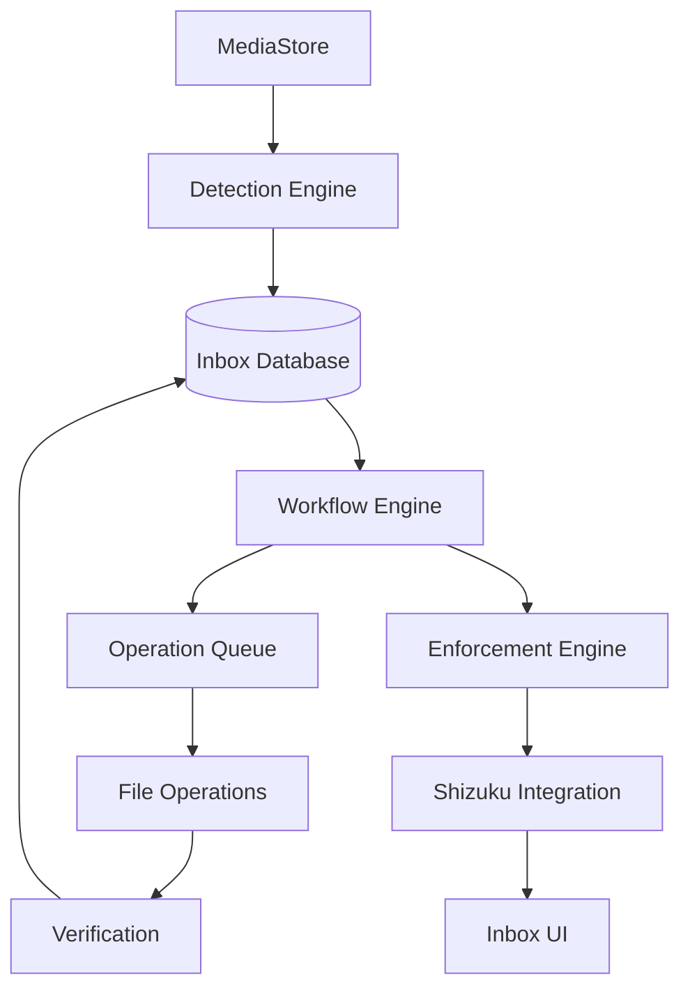

# Enforcement Engine Architecture (v0.7)

The Enforcement Engine is the core organizational workflow of cGallery. It ensures that newly detected media is organized before it becomes part of the permanent gallery.

## Architecture

## Subsystems

### 1. Detection Engine
- Monitors `MediaStore` for new images/videos in monitored folders.
- Uses `ContentObserver` for real-time detection.
- Creates `InboxItem` in `Detected` state.

### 2. Workflow Engine
- Manages state transitions for Inbox items.
- States: `Detected`, `Queued`, `Processing`, `Verifying`, `Completed`, `Failed`, `Ignored`.

### 3. Operation Queue
- Persistent queue for file operations.
- Handles `Move` and `Copy` tasks.
- Recovers state after app restarts or crashes.

### 4. Enforcement Engine & Sessions
- Triggers an "Enforcement Session" when new items require attention.
- Integration with **Shizuku** allows automatic background-to-foreground transitions.
- **Snooze System**:
    - **1 Hour**: Suppresses sessions for 60 minutes.
    - **50 Images**: Suppresses until 50 new items accumulate.

### 5. File Verification
- Every operation is verified by checking destination file existence and size match.
- Partial successes are treated as failures to ensure library integrity.

## Enforcement Filtering
When enforcement is enabled, `MediaStoreViewModel` dynamically filters out media items that are currently pending in the Inbox. This ensures the main Gallery only shows organized content.
