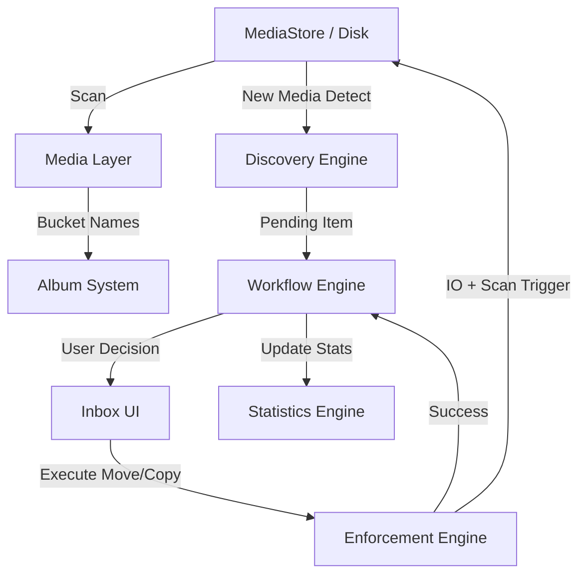

# 03 - System Architecture

## Component Overview

cGallery is built as a set of interacting managers and engines centered around a **Virtual Album Database (Room)**.

### 1. Media Layer (Ingestion & Scan)
*   **Responsibility:** Interacts with the Android `MediaStore` and `java.io.File`.
*   **Components:** `MediaStoreDataSource`, `PhysicalAlbumManager`.
*   **Action:** Syncs physical bucket names with the `physical_albums` table.

### 2. Discovery Engine (Inbox Trigger)
*   **Responsibility:** Monitors `monitored_folders` for new media.
*   *Detection Logic:* Compares `MediaStore.dateAdded` against the folder's `ignoreBeforeTimestamp`.
*   **Output:** Creates `InboxItemEntity` records in a `Pending` state.

### 3. Workflow Engine (Inbox Manager)
*   **Responsibility:** Manages the lifecycle of an Inbox item.
*   **States:** `Pending`, `Processing`, `Completed`, `Failed`, `Ignored`.
*   **Logic:** Orchestrates the transition from discovery to final physical placement.

### 4. Enforcement Engine (Physical Sync)
*   **Responsibility:** Executes the physical I/O commands (MOVE/COPY).
*   **Action:** Performs file system operations, triggers `MediaScannerConnection`, and updates internal `InboxStats`.

### 5. Album System (Logical Hierarchies)
*   **Responsibility:** Manages the relationship between `PhysicalAlbumEntity` (buckets) and `AlbumGroupEntity` (folders).
*   **Feature:** Supports nested groups and custom covers with persistent cropping data.

### 6. Gallery System (UI/UX)
*   **Responsibility:** The Jetpack Compose presentation layer.
*   **Focus:** Samsung-inspired grids, mixed-content sorting, and cinematic transitions.

## Data Flow Diagram

## System Constraints
*   **Local-First:** All operations are offline.
*   **Permission Conscious:** Uses MediaStore and File APIs, requiring Scoped Storage awareness.
*   **Transactional Safety:** Database records only update when I/O operations confirm success.
