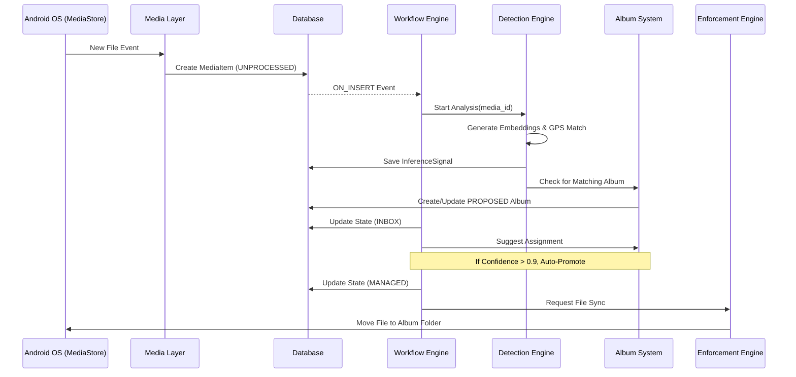
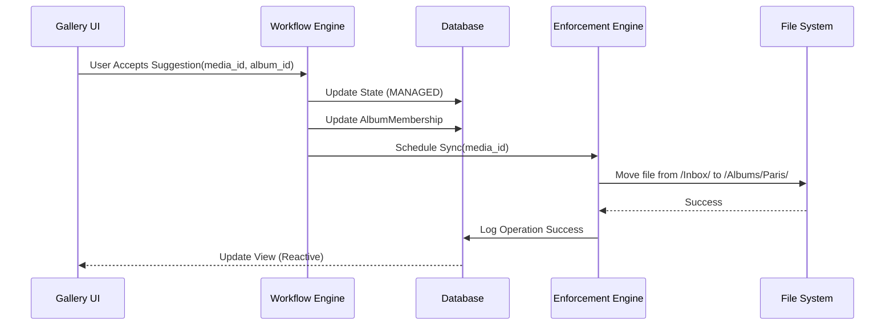
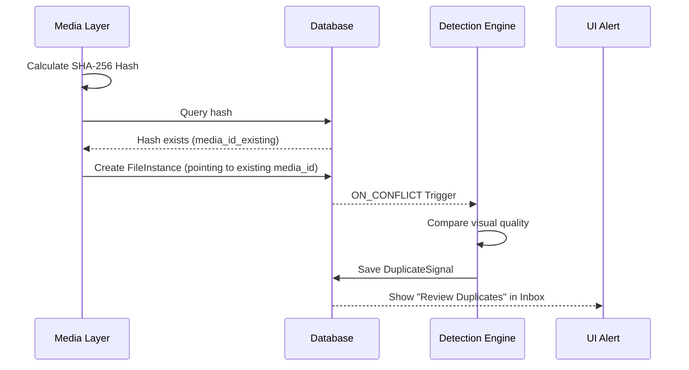

# 23 - Sequence Diagrams

## 1. Media Ingestion & Auto-Organization

This diagram shows the flow from discovering a new file to it being placed in an album.

## 2. User Triage (Inbox Action)

This diagram shows how the system responds to a user accepting a suggested grouping.

## 3. Duplicate Detection & Resolution

## Key Timing Constraints
*   **Ingestion (ML to DB):** < 100ms per file.
*   **Inference (DE):** 500ms - 2s (backgrounded).
*   **UI Update (DB to View):** < 16ms (60fps target).
*   **File Move (EE):** Variable (disk I/O).
